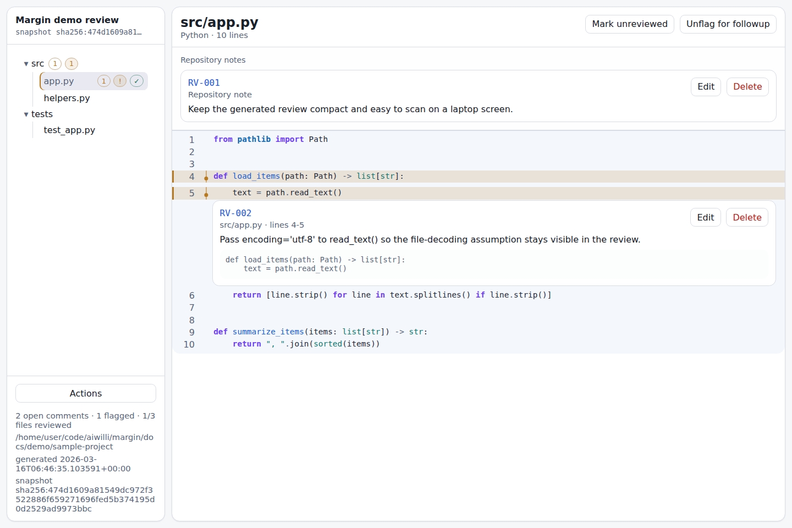
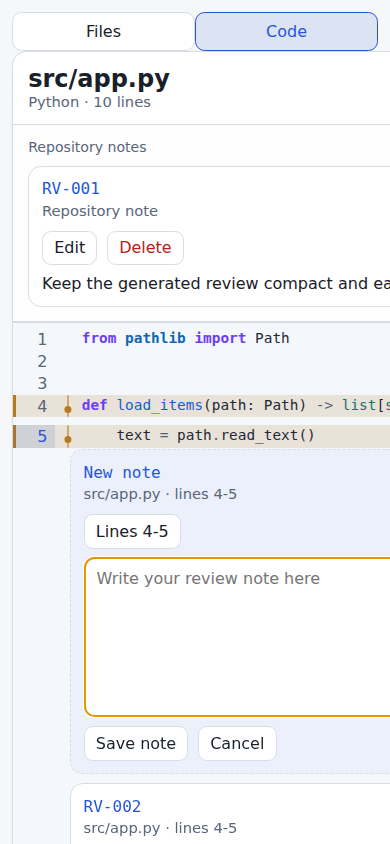

# Margin

Margin is a local-first code review workspace. It turns a repository snapshot into one self-contained HTML file, lets you leave persistent review comments in the browser, and exports the findings as markdown or JSON.

## What it does

- reviews a local directory or a GitHub repository
- renders a file tree, syntax-highlighted code, inline note threads, and inline note drafting into one static HTML artifact
- supports repository, file, and line-range comments plus per-file reviewed and followup-flagged states
- autosaves review state in browser local storage for the exact snapshot being reviewed
- exports open comments as markdown for agent sessions and exports/imports JSON review state
- can serve the same artifact over a small local HTTP server when you want a stable URL

## Requirements

- Python 3.12+
- git
- `gh` with repository access for `build-github` and `serve-github`

## Run it

From the repository root:

```bash
uv sync
```

Build a self-contained review HTML file:

```bash
uv run margin build docs/demo/sample-project --output docs/demo/build/review.html --title "Margin demo review"
```

```text
/home/user/code/aiwilli/margin/docs/demo/build/review.html
```

Open the written HTML file directly in a browser, or serve the same artifact over local HTTP:

```bash
uv run margin serve docs/demo/sample-project --port 5184
```

```text
http://127.0.0.1:5184/review.html
```

GitHub repositories use the same flow:

```bash
uv run margin build-github owner/repo --output review.html
uv run margin serve-github owner/repo --ref main
```

## Screenshots

Desktop review view generated from `docs/demo/sample-project`:



Mobile inline note composer on an iPhone-sized viewport:


