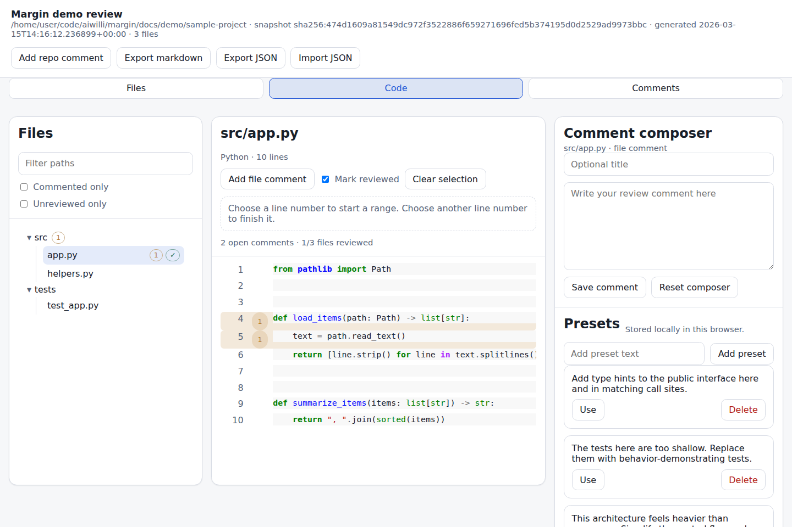
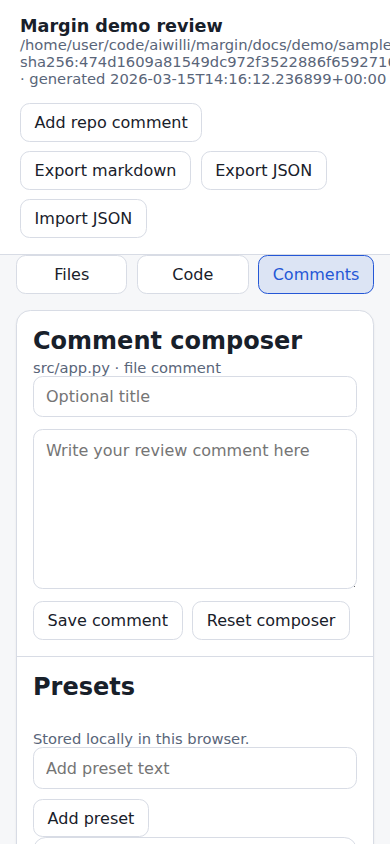

# Margin README proof

*2026-03-15T14:16:07Z by Showboat 0.6.1*
<!-- showboat-id: 4e23eca0-54ad-4d41-9480-7a59aeb2a5cf -->

This document records the commands and assets used for the repository README. It builds a review from the sample project, captures the serve URL, and generates desktop and mobile screenshots.

```bash
mkdir -p docs/demo/build docs/demo/screenshots && ./.venv/bin/margin --quiet build docs/demo/sample-project --output docs/demo/build/review.html --title 'Margin demo review'
```

```output
/home/user/code/aiwilli/margin/docs/demo/build/review.html
```

```python3
import signal
import subprocess

process = subprocess.Popen(
    ["./.venv/bin/margin", "--quiet", "serve", "docs/demo/sample-project", "--port", "5184"],
    stdout=subprocess.PIPE,
    stderr=subprocess.PIPE,
    text=True,
)
try:
    line = process.stdout.readline().strip()
    if not line:
        error_output = process.stderr.read().strip()
        raise SystemExit(error_output or "margin serve did not print a URL")
    print(line)
finally:
    if process.poll() is None:
        process.send_signal(signal.SIGINT)
        try:
            process.wait(timeout=5)
        except subprocess.TimeoutExpired:
            process.kill()
            process.wait(timeout=5)

```

```output
http://127.0.0.1:5184/review.html
```

```bash
node docs/demo/capture_readme_screenshots.mjs --review docs/demo/build/review.html --output-dir docs/demo/screenshots --playwright-module /home/user/code/my-pi-web/node_modules/playwright/index.mjs
```

```output
/home/user/code/aiwilli/margin/docs/demo/screenshots/margin-desktop.png
/home/user/code/aiwilli/margin/docs/demo/screenshots/margin-mobile.png
```

```bash {image}

```



```bash {image}

```


